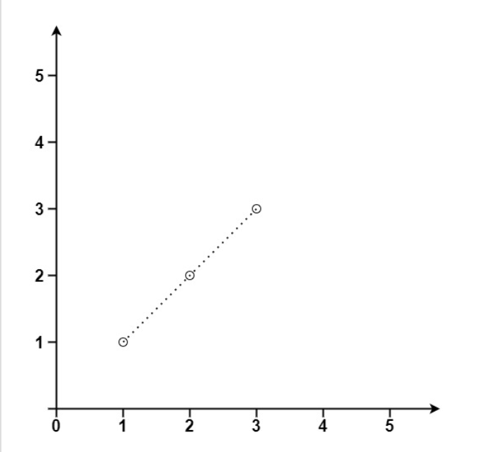

Given an array of points where points[i] = [xi, yi] represents a point on the X-Y plane, return the maximum number of points that lie on the same straight line.

Example 1:

Input: points = [[1,1],[2,2],[3,3]]

Output: 3

Example 2:

Input:

points = [[1,1],[3,2],[5,3],[4,1],[2,3],[1,4]]

Output: 4

Constraints:

1 <= points.length <= 300
points[i].length == 2
-104 <= xi, yi <= 104
All the points are unique.